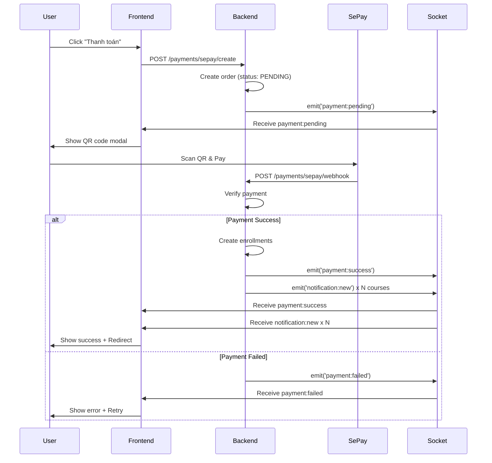

# 🔌 Socket Events Mapping - Backend ↔ Frontend

## ✅ Tất cả events đã khớp hoàn toàn

| Event Name         | Backend Emit Method         | Frontend Listener     | Data Structure |
| ------------------ | --------------------------- | --------------------- | -------------- |
| `payment:pending`  | `notifyPaymentPending()`    | `onPaymentPending()`  | ✅ Matched     |
| `payment:success`  | `notifyPaymentSuccess()`    | `onPaymentSuccess()`  | ✅ Matched     |
| `payment:failed`   | `notifyPaymentFailed()`     | `onPaymentFailed()`   | ✅ Matched     |
| `notification:new` | `notifyEnrollmentCreated()` | `onNotificationNew()` | ✅ **FIXED**   |

---

## 📡 Chi tiết Events

### 1️⃣ **payment:pending**

**Backend Emit:**

```typescript
// File: sepay.service.ts
this.notificationGateway.notifyPaymentPending(userId, {
  orderId: number,
  amount: number,
  qrUrl?: string,
  message?: string
})
```

**Data Structure:**

```typescript
{
  type: 'payment:pending',
  message: 'Đang chờ thanh toán. Vui lòng quét mã QR để hoàn tất.',
  timestamp: 1698412800000,
  data: {
    paymentStatus: 'PENDING',
    orderId: 123,
    amount: 500000,
    qrUrl: 'https://qr.sepay.vn/img?...',
    message: '...'
  }
}
```

**Frontend Usage:**

```typescript
const cleanup = onPaymentPending((data) => {
  console.log('Payment pending:', data)
  // Show QR code modal
  setQrCode(data.data.qrUrl)
})

return cleanup // Call to unsubscribe
```

---

### 2️⃣ **payment:success**

**Backend Emit:**

```typescript
// File: sepay.service.ts (in handleWebhook)
this.notificationGateway.notifyPaymentSuccess(userId, {
  orderId: number,
  transactionId?: string,
  amount: number,
  courseIds?: number[],
  message?: string
})
```

**Data Structure:**

```typescript
{
  type: 'payment:success',
  message: 'Thanh toán thành công! Bạn đã được ghi danh vào khóa học.',
  timestamp: 1698412900000,
  data: {
    paymentStatus: 'SUCCESS',
    orderId: 123,
    transactionId: 'TXN_ABC123',
    amount: 500000,
    courseIds: [1, 2, 3],
    message: '...'
  }
}
```

**Frontend Usage:**

```typescript
const cleanup = onPaymentSuccess((data) => {
  console.log('Payment successful:', data)
  toast.success('Thanh toán thành công!')

  // Redirect to enrolled courses
  router.push('/my-courses')
})

return cleanup
```

---

### 3️⃣ **payment:failed**

**Backend Emit:**

```typescript
// File: sepay.service.ts
this.notificationGateway.notifyPaymentFailed(userId, {
  orderId: number,
  amount: number,
  errorMessage?: string,
  message?: string
})
```

**Data Structure:**

```typescript
{
  type: 'payment:failed',
  message: 'Thanh toán thất bại. Vui lòng thử lại.',
  timestamp: 1698412950000,
  data: {
    paymentStatus: 'FAILED',
    orderId: 123,
    amount: 500000,
    errorMessage: 'Số tiền không khớp. Mong đợi: 500000, Nhận: 450000',
    message: '...'
  }
}
```

**Frontend Usage:**

```typescript
const cleanup = onPaymentFailed((data) => {
  console.error('Payment failed:', data)
  toast.error(data.data.errorMessage || 'Thanh toán thất bại')

  // Show retry modal
  setShowRetryModal(true)
})

return cleanup
```

---

### 4️⃣ **notification:new** ⚠️ (Previously `enrollment:created`)

**Backend Emit:**

```typescript
// File: sepay.service.ts (in handleWebhook - for each course)
this.notificationGateway.notifyEnrollmentCreated(userId, {
  courseId: number,
  courseTitle: string,
  courseThumbnail?: string,
  expiresAt?: Date
})
```

**Data Structure:**

```typescript
{
  type: 'notification:new',
  message: 'Bạn đã được ghi danh vào khóa học: Japanese N5 Complete',
  timestamp: 1698413000000,
  data: {
    notificationType: 'ENROLLMENT_CREATED',
    courseId: 1,
    courseTitle: 'Japanese N5 Complete',
    courseThumbnail: 'https://...',
    expiresAt: '2025-10-27T00:00:00.000Z'
  }
}
```

**Frontend Usage:**

```typescript
const cleanup = onNotificationNew((data) => {
  console.log('New notification:', data)

  // Check notification type
  if (data.data.notificationType === 'ENROLLMENT_CREATED') {
    toast.info(`Enrolled in: ${data.data.courseTitle}`)

    // Add to notifications list
    setNotifications((prev) => [data, ...prev])
  }
})

return cleanup
```

**⚠️ Important Note:**

- Backend changed from `enrollment:created` → `notification:new` to match frontend
- Use `data.notificationType === 'ENROLLMENT_CREATED'` to distinguish enrollment notifications
- This event is emitted **for each course** in the order (can be multiple times)

---

## 🔄 Payment Flow với Socket Events



---

## 🧪 Testing Socket Events

### Setup Connection

```typescript
const socket = io('http://localhost:4000/notification', {
  transports: ['websocket'],
  query: { userId: '123' }, // Your user ID
})

socket.on('connect', () => {
  console.log('✅ Connected to notification socket')
})

socket.on('notification', (data) => {
  console.log('📬 Received:', data.type, data)
})
```

### Test với Postman hoặc cURL

**1. Create Payment:**

```bash
curl -X POST http://localhost:4000/payments/sepay/buy-direct \
  -H "Authorization: Bearer YOUR_TOKEN" \
  -H "Content-Type: application/json" \
  -d '{"courseId": 1, "couponCode": "SALE20"}'
```

**Expected Socket Event:**

```json
{
  "type": "payment:pending",
  "message": "Đơn hàng #123 đang chờ thanh toán...",
  "timestamp": 1698412800000,
  "data": {
    "paymentStatus": "PENDING",
    "orderId": 123,
    "amount": 400000,
    "qrUrl": "https://qr.sepay.vn/img?..."
  }
}
```

**2. Simulate Webhook (for testing):**

```bash
curl -X POST http://localhost:4000/payments/sepay/webhook \
  -H "Content-Type: application/json" \
  -d '{
    "id": "TXN_TEST123",
    "transferType": "in",
    "transferAmount": 400000,
    "content": "TKPTPR DHMC123T1698412800000",
    "transactionDate": "2024-10-27 16:00:00"
  }'
```

**Expected Socket Events:**

```json
// Event 1: payment:success
{
  "type": "payment:success",
  "message": "Thanh toán thành công cho đơn hàng #123...",
  "timestamp": 1698412900000,
  "data": {
    "paymentStatus": "SUCCESS",
    "orderId": 123,
    "transactionId": "TXN_TEST123",
    "amount": 400000,
    "courseIds": [1]
  }
}

// Event 2: notification:new (for each course)
{
  "type": "notification:new",
  "message": "Bạn đã được ghi danh vào khóa học: Japanese N5 Complete",
  "timestamp": 1698412901000,
  "data": {
    "notificationType": "ENROLLMENT_CREATED",
    "courseId": 1,
    "courseTitle": "Japanese N5 Complete",
    "expiresAt": "2025-10-27T00:00:00.000Z"
  }
}
```

---

## 📝 Frontend Implementation Example

```typescript
import { useEffect } from 'react'
import { useSocketNotification } from '@/hooks/useSocketNotification'
import { toast } from 'sonner'
import { useRouter } from 'next/navigation'

export default function PaymentPage() {
  const router = useRouter()
  const {
    onPaymentPending,
    onPaymentSuccess,
    onPaymentFailed,
    onNotificationNew
  } = useSocketNotification()

  useEffect(() => {
    // Listen for payment pending
    const cleanup1 = onPaymentPending((data) => {
      console.log('⏳ Payment pending:', data)
      // Show QR code modal with data.data.qrUrl
    })

    // Listen for payment success
    const cleanup2 = onPaymentSuccess((data) => {
      console.log('✅ Payment successful:', data)
      toast.success('Thanh toán thành công!')

      // Wait a bit for enrollment notifications
      setTimeout(() => {
        router.push('/my-courses')
      }, 2000)
    })

    // Listen for payment failed
    const cleanup3 = onPaymentFailed((data) => {
      console.error('❌ Payment failed:', data)
      toast.error(data.data.errorMessage || 'Thanh toán thất bại')
    })

    // Listen for new notifications (enrollments)
    const cleanup4 = onNotificationNew((data) => {
      if (data.data.notificationType === 'ENROLLMENT_CREATED') {
        console.log('🎓 Enrolled:', data.data.courseTitle)
        toast.info(`Enrolled in: ${data.data.courseTitle}`)
      }
    })

    // Cleanup all listeners on unmount
    return () => {
      cleanup1()
      cleanup2()
      cleanup3()
      cleanup4()
    }
  }, [])

  return (
    <div>
      {/* Your payment UI */}
    </div>
  )
}
```

---

## 🔧 Changes Made

### ✅ Fixed Issues:

1. **Changed `enrollment:created` → `notification:new`**
   - File: `notification.gateway.ts`
   - Line 267: Updated event type to match frontend listener
   - Line 28: Updated TypeScript interface

### 📁 Files Modified:

- `src/websockets/notification.gateway.ts`
  - Updated `ClassNotification` interface type union
  - Changed `notifyEnrollmentCreated()` method to emit `notification:new`

### ⚠️ Breaking Changes:

None - This change makes backend compatible with existing frontend code.

---

## 📚 Related Documentation

- [WEBSOCKET_PAYMENT_EVENTS.md](./WEBSOCKET_PAYMENT_EVENTS.md) - Detailed payment events docs
- [GUIDE_SEPAY_PAYMENT.md](./GUIDE_SEPAY_PAYMENT.md) - SePay integration guide
- [GUIDE_BUY_COURSE_DIRECT.md](./GUIDE_BUY_COURSE_DIRECT.md) - Direct purchase API

---

**Last Updated:** October 27, 2025  
**Status:** ✅ All events matched and synchronized
